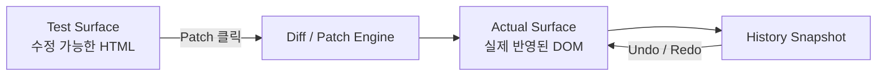
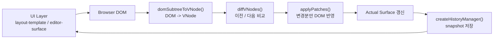
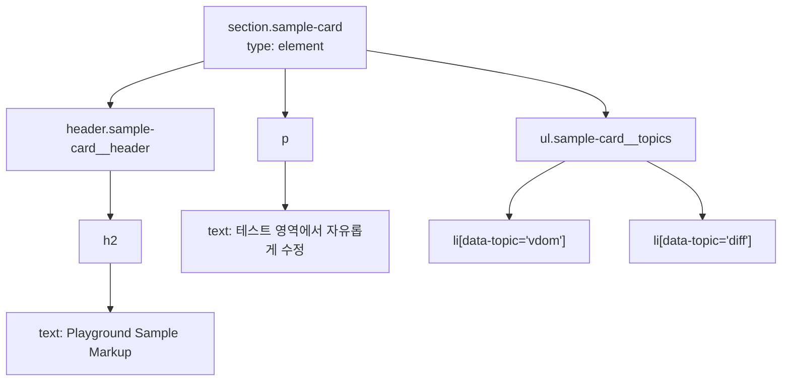
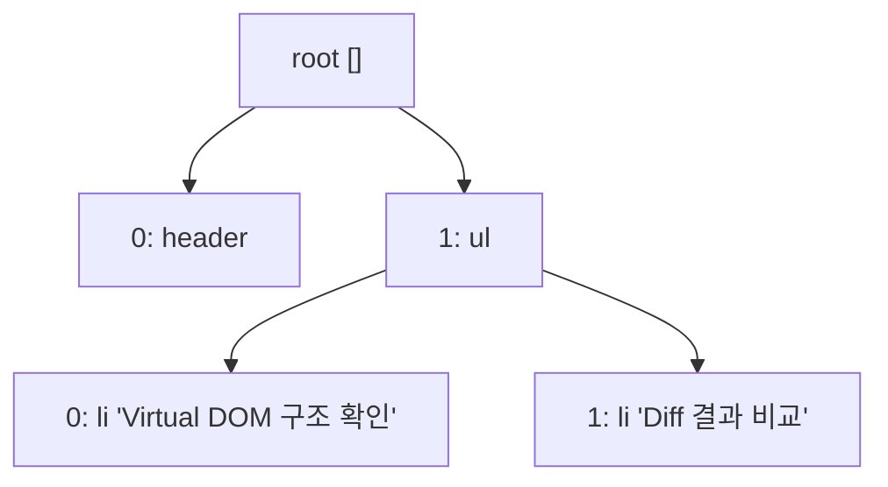
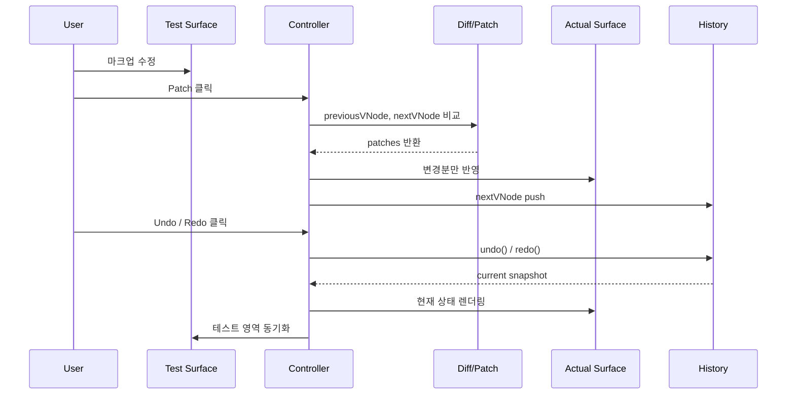

# Virtual DOM Diff Playground

테스트 영역에서 HTML을 수정하고, `Diff / Patch / History` 흐름으로 실제 DOM에 변경분만 반영해 보는 실험형 웹 앱입니다.

## 발표 구성 한눈에 보기

| 구간 | 시간 | 핵심 메시지 |
| --- | --- | --- |
| 오프닝 | 20초 | 이 프로젝트는 mini React의 핵심 원리를 직접 눈으로 확인하는 데모입니다. |
| 서비스 소개 | 35초 | 전체를 다시 그리지 않고, 바뀐 부분만 반영하는 흐름을 보여줍니다. |
| 팀원 역할 분배 | 35초 | Virtual DOM, Diff/Patch, UI, History를 4개 역할로 나눠 협업했습니다. |
| 설계 | 45초 | 단일 페이지, Vanilla JS, 공통 인터페이스 계약, 파일 경계로 설계를 단순화했습니다. |
| 핵심 개념 | 1분 25초 | `VNode`, `diffVNodes`, `applyPatches`, `createHistoryManager`가 핵심입니다. |
| 마무리 | 20초 | 직접 만든 mini React 구조를 통해 렌더링 원리를 체험했습니다. |

총 발표 시간은 약 4분입니다.

## 1. 오프닝

이 프로젝트의 목적은 React가 내부에서 처리하는 핵심 개념을 라이브러리 없이 직접 구현해 보는 것입니다.  
브라우저 DOM을 Virtual DOM으로 바꾸고, 이전 상태와 다음 상태를 비교한 뒤, 실제 DOM에는 필요한 변경만 적용합니다.

> 발표 멘트  
> "저희 프로젝트는 Virtual DOM 기반 렌더링 원리를 직접 구현해 본 mini React 실험입니다.  
> 사용자는 테스트 영역에서 HTML을 수정하고, Patch 버튼을 누르면 실제 영역에는 바뀐 부분만 반영됩니다."

## 2. 서비스 소개

### 왜 만들었는가

- 단순히 `innerHTML` 전체를 다시 쓰면 구현은 쉽지만, 어떤 부분이 바뀌었는지 알기 어렵습니다.
- 이 프로젝트는 "변경 감지"와 "부분 반영"을 직접 구현해 렌더링 최적화의 핵심 원리를 학습하는 데 초점을 맞췄습니다.
- Undo / Redo까지 포함해 상태 변화가 어떻게 관리되는지도 함께 보여줍니다.

### 사용 흐름

1. 사용자가 `Test Surface`에서 마크업을 수정합니다.
2. `Patch` 버튼을 누르면 `readTestMarkup()`이 테스트 영역의 HTML 문자열을 읽어옵니다.
3. 읽어온 문자열은 `createDetachedWrapper()`를 통해 임시 `div` DOM으로 바뀝니다.
4. 현재 화면 상태는 `history.current()`로 가져오고, 새로 수정한 상태는 `createContentRootVNode()`로 VNode로 변환합니다.
5. `diffVNodes(previousVNode, nextVNode)`가 두 상태를 비교해서 patch 목록을 만듭니다.
6. `applyPatches()`가 patch 목록을 실제 영역 DOM에 반영합니다.
7. 마지막으로 `history.push(nextVNode)`로 새 상태를 저장하고, 두 화면을 다시 맞춰 `Undo / Redo`가 가능해집니다.

### 코드로 보면 더 쉽게

실제 핵심 코드는 `src/app/controller.js`의 `Patch` 버튼 이벤트 안에 들어 있습니다.  
중요한 점은 "문자열을 바로 실제 DOM에 덮어쓰지 않는다"는 것입니다. 먼저 비교 가능한 VNode로 바꾼 뒤, 차이만 계산해서 반영합니다.

```js
uiRefs.patchButton.addEventListener("click", () => {
  const testMarkup = readTestMarkup(uiRefs.testSurface);
  const wrapper = createDetachedWrapper(testMarkup);

  const previousVNode = history.current();
  const nextVNode = createContentRootVNode(wrapper);
  const patches = diffVNodes(previousVNode, nextVNode);

  actualSurfaceElement = applyPatches(actualSurfaceElement, patches) ?? actualSurfaceElement;
  history.push(nextVNode);

  writeMarkup(actualSurfaceElement, contentVNodeToMarkup(history.current()));
  writeMarkup(uiRefs.testSurface, contentVNodeToMarkup(history.current()));
  setNavigationState(uiRefs, createHistoryState(history));
});
```

이 코드를 한 줄씩 말로 풀면 아래와 같습니다.

| 코드 요소 | 쉬운 설명 |
| --- | --- |
| `readTestMarkup()` | 사용자가 수정한 HTML을 문자열로 읽습니다. |
| `createDetachedWrapper()` | 읽은 문자열을 비교 가능한 임시 DOM으로 바꿉니다. |
| `history.current()` | 지금 화면에 보이는 이전 상태를 가져옵니다. |
| `createContentRootVNode()` | 새 DOM을 VNode 트리로 바꿉니다. |
| `diffVNodes()` | 이전 상태와 새 상태를 비교해 "어디가 어떻게 바뀌었는지" 계산합니다. |
| `applyPatches()` | 계산된 변경만 실제 DOM에 반영합니다. |
| `history.push()` | 반영이 끝난 새 상태를 저장합니다. |
| `writeMarkup()` | 실제 영역과 테스트 영역을 같은 최신 상태로 다시 맞춥니다. |

즉, 코드 흐름은 아래 한 문장으로 정리할 수 있습니다.

`수정한 HTML 읽기 -> 임시 DOM 만들기 -> VNode 변환 -> diff 계산 -> patch 적용 -> history 저장 -> 화면 동기화`

### Undo / Redo는 어떻게 동작하는가

- `undo()`는 History에서 한 단계 이전 snapshot을 가져옵니다.
- `redo()`는 다시 다음 snapshot으로 이동합니다.
- 가져온 snapshot은 `writeMarkup()`으로 실제 영역과 테스트 영역에 다시 렌더링됩니다.
- 즉, Undo / Redo도 DOM을 직접 조작하는 기능이 아니라, 저장해 둔 상태를 다시 보여주는 방식입니다.



> 발표 멘트  
> "서비스 구조는 아주 단순합니다. 오른쪽 테스트 영역에서 마크업을 바꾸고 Patch를 누르면, 실제 영역에는 전체가 아니라 변경분만 반영됩니다.  
> 그리고 그 결과를 History에 저장해서 Undo와 Redo까지 이어지는 흐름을 한 화면에서 확인할 수 있습니다."

## 3. 팀원 역할 분배

이번 프로젝트는 기능 축을 기준으로 역할을 나눴고, 각자 자기 파일만 수정하는 규칙으로 협업했습니다.

| 역할 | 담당 영역 | 대표 파일 | 협업 경계 |
| --- | --- | --- | --- |
| 구름 | `Virtual DOM Core` | `src/core/vdom-node.js`, `src/core/dom-to-vdom.js`, `src/core/vdom-to-html.js` | DOM을 VNode로 바꾸고 다시 HTML로 직렬화 |
| 이정현 | `Diff / Patch Engine` | `src/diff/diff.js`, `src/diff/patch-dom.js` | 이전/다음 VNode 차이 계산, 실제 DOM 부분 반영 |
| 이규정 | `Playground UI` | `src/ui/layout-template.js`, `src/ui/editor-surface.js`, `src/styles/ui.css` | 실제 영역, 테스트 영역, 버튼 UI, 편집 보조 |
| 송채강 | `History / App Controller` | `src/state/history-manager.js`, `src/app/controller.js`, `src/app/view-sync.js` | 앱 초기화, 이벤트 연결, 상태 이동, 화면 동기화 |

### 역할 분배의 핵심

- 역할마다 파일 경계를 명확히 나눠 머지 충돌을 줄였습니다.
- 공통 계약은 `docs/INTERFACES.md`로 고정해 함수 이름과 입출력을 통일했습니다.
- UI, 자료구조, 알고리즘, 상태 관리를 분리해 각 역할이 독립적으로 구현될 수 있게 했습니다.

> 발표 멘트  
> "저희는 기능별로 Virtual DOM, Diff/Patch, UI, History를 분리했습니다.  
> 특히 공통 인터페이스 문서를 기준으로 export 이름과 시그니처를 맞춰서, 파일을 건드리지 않고도 병렬 협업이 가능하도록 설계했습니다."

## 4. 설계

### 설계 방향

- `단일 페이지 구조`
  브라우저 한 화면에서 실제 영역, 테스트 영역, 컨트롤 버튼을 모두 제공합니다.
- `Vanilla JavaScript`
  프레임워크 없이도 Virtual DOM의 핵심 동작을 직접 구현하는 데 집중했습니다.
- `공통 인터페이스 계약`
  `VNode` 구조, patch 형식, UI selector, History 메서드를 문서로 고정했습니다.
- `역할별 파일 경계`
  각 역할은 자기 소유 파일만 수정하도록 해 협업 비용을 줄였습니다.

### 아키텍처 흐름



### 실제 구현 포인트

- `src/app/controller.js`가 전체 흐름을 연결합니다.
- 초기 로딩 시 샘플 마크업을 실제 영역에 렌더링하고, 이를 첫 번째 History 상태로 저장합니다.
- 이후 `Patch`, `Undo`, `Redo` 버튼 이벤트가 모두 Controller를 통해 동작합니다.

> 발표 멘트  
> "설계는 한마디로 흐름 중심입니다. UI에서 입력을 받고, DOM을 VNode로 바꾸고, Diff를 계산한 뒤, Patch로 실제 DOM만 업데이트하고, 마지막으로 History에 저장합니다.  
> React의 큰 흐름을 가장 단순한 형태로 잘라서 보여주는 구조라고 보시면 됩니다."

## 5. 핵심 개념

### 5-1. VNode 구조

이 프로젝트의 모든 비교와 상태 저장은 `VNode`를 기준으로 이뤄집니다.

```js
{
  type: "element" | "text",
  tagName: string | null,
  attributes: { [key: string]: string },
  children: VNode[],
  textContent: string | null
}
```

- `element` 노드는 태그명, 속성, 자식을 가집니다.
- `text` 노드는 문자열만 가집니다.
- 브라우저 DOM을 그대로 다루지 않고, 비교하기 쉬운 트리 구조로 한 번 변환합니다.



> 발표 멘트  
> "핵심은 실제 DOM을 바로 비교하지 않고, 먼저 VNode라는 단순한 트리 구조로 바꾼다는 점입니다.  
> 이렇게 바꾸면 태그, 속성, 텍스트, 자식 노드를 규칙적으로 비교할 수 있어서 이후 Diff와 History 관리가 쉬워집니다."

### 5-2. Diff: 이전 상태와 다음 상태를 비교하는 방법

`diffVNodes(previousNode, nextNode, path = [])`는 두 VNode를 비교해 patch 배열을 만듭니다.

- 노드 타입이 바뀌면 `REPLACE_NODE`
- 텍스트가 바뀌면 `UPDATE_TEXT`
- 속성이 바뀌면 `SET_ATTRIBUTE` 또는 `REMOVE_ATTRIBUTE`
- 자식이 추가/삭제되면 `INSERT_CHILD` 또는 `REMOVE_CHILD`

이때 중요한 것이 `path`입니다. `path`는 루트에서 시작하는 자식 인덱스 배열로, 어느 노드가 바뀌었는지 정확히 가리킵니다.



예를 들어 `path: [1, 0]`은 "루트의 두 번째 자식인 `ul` 아래, 첫 번째 `li`"를 의미합니다.

```js
{
  type: "UPDATE_TEXT",
  path: [1, 0],
  payload: {
    textContent: "Virtual DOM 핵심 구조 이해"
  }
}
```

> 발표 멘트  
> "Diff의 핵심은 무엇이 바뀌었는지뿐 아니라 어디가 바뀌었는지를 찾는 것입니다.  
> 여기서 `path`가 노드의 주소 역할을 하면서, 이후 Patch 단계가 정확한 위치만 수정할 수 있게 도와줍니다."

### 5-3. Patch: 실제 DOM에는 필요한 변경만 반영

`applyPatches(rootElement, patches)`는 Diff 결과를 받아 실제 DOM에 적용합니다.

- 텍스트만 바뀌면 텍스트만 수정합니다.
- 속성만 바뀌면 해당 속성만 수정합니다.
- 자식이 추가되면 필요한 위치에만 삽입합니다.
- 전체를 다시 렌더링하지 않고, 필요한 노드만 건드리는 것이 핵심입니다.

이 구조 덕분에 사용자는 "무엇이 바뀌었는지"를 더 선명하게 볼 수 있고, mini React의 핵심 아이디어도 직관적으로 이해할 수 있습니다.

### 5-4. History: 상태를 되돌리는 구조

`createHistoryManager(limit = 20)`는 VNode snapshot을 저장하고, 상태 이동을 담당합니다.

- `push(vNode)`로 새 상태를 저장합니다.
- `undo()`와 `redo()`로 이전/다음 상태를 꺼냅니다.
- Undo 이후 새 Patch가 발생하면 기존 Redo 기록은 잘라냅니다.
- 히스토리 개수는 최대 20개로 제한합니다.



> 발표 멘트  
> "History는 단순히 화면만 되돌리는 것이 아니라, VNode snapshot 자체를 저장합니다.  
> 그래서 Undo와 Redo도 화면 조작이 아니라 상태 이동으로 처리되고, 이 점이 상태 기반 UI 구조를 이해하는 데 중요한 포인트입니다."

## 6. 발표에서 꼭 짚을 인터페이스

| 인터페이스 | 발표용 설명 |
| --- | --- |
| `VNode` | DOM을 비교하기 쉬운 트리 구조로 바꾼 데이터 모델 |
| `diffVNodes(previousNode, nextNode, path = [])` | 이전 상태와 다음 상태를 비교해 patch 목록을 만드는 함수 |
| `applyPatches(rootElement, patches)` | patch 목록을 실제 DOM에 적용하는 함수 |
| `createHistoryManager(limit = 20)` | 상태 snapshot을 저장하고 Undo/Redo를 관리하는 객체 |

이 4개만 이해해도 이 프로젝트의 핵심 동작 원리는 대부분 설명할 수 있습니다.

## 7. 마무리

### 구현 성과 요약

- 브라우저 DOM을 Virtual DOM으로 변환하고 비교하는 흐름을 직접 구현했습니다.
- 변경분만 실제 DOM에 반영하는 Patch 구조를 눈으로 확인할 수 있게 만들었습니다.
- 상태 snapshot 기반의 Undo / Redo까지 연결해 mini React의 핵심 개념을 한 화면에 담았습니다.

> 발표 멘트  
> "정리하면, 저희는 단순한 UI를 만든 것이 아니라 mini React의 핵심 원리를 직접 구현해 본 프로젝트를 완성했습니다.  
> Virtual DOM, Diff, Patch, History를 직접 연결해 보면서 프레임워크가 내부에서 해 주는 일을 더 깊게 이해할 수 있었습니다."
